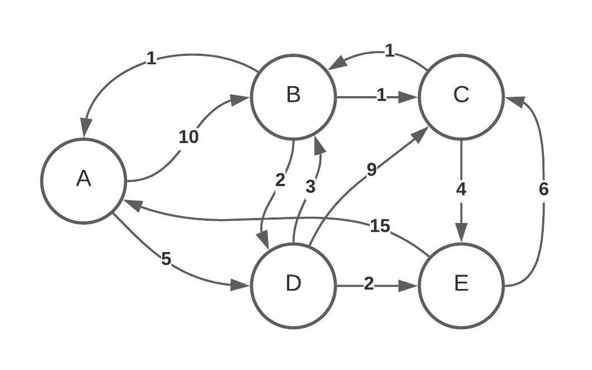
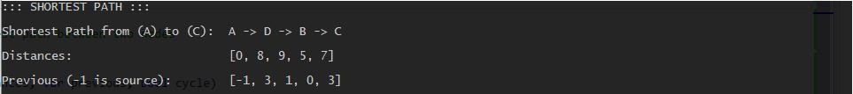
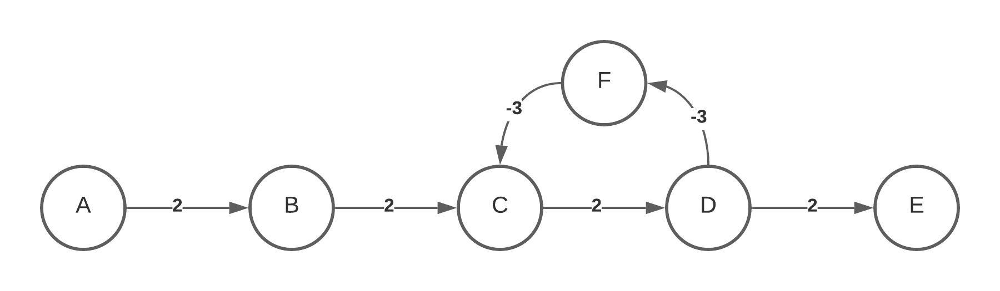
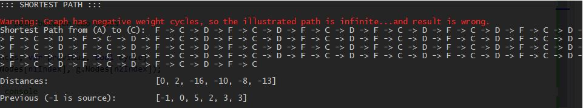
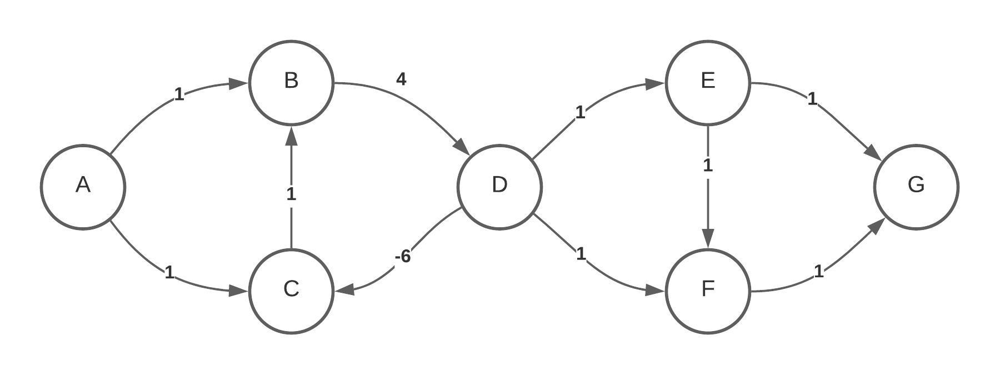
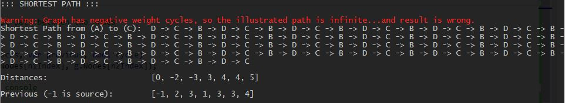
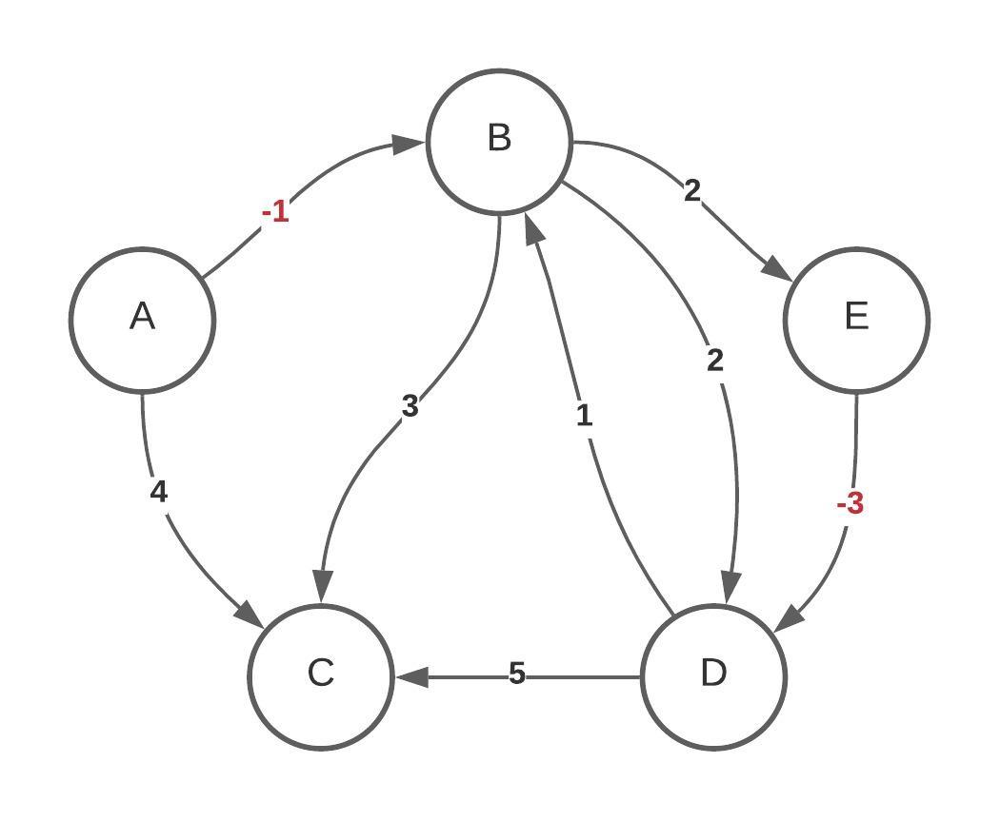

# CA.GraphShortestPath
Shortest path using Dijsktra or Bellman-Ford algorithm.
Dijsktra is used for directed graphs with no negative weights.
Bellman-Ford is used for directed graphs with negative weights. The output is correct iff no negative cycles.

## Illustration of the graphs used in the code example
### Graph 1: No negative weights (no negative cycles)

### Graph 2: Negative weights (negative cycles)

### Graph 3: Negative weights (negative cycles)

### Graph 4: Negative weights (no negative cycles)

